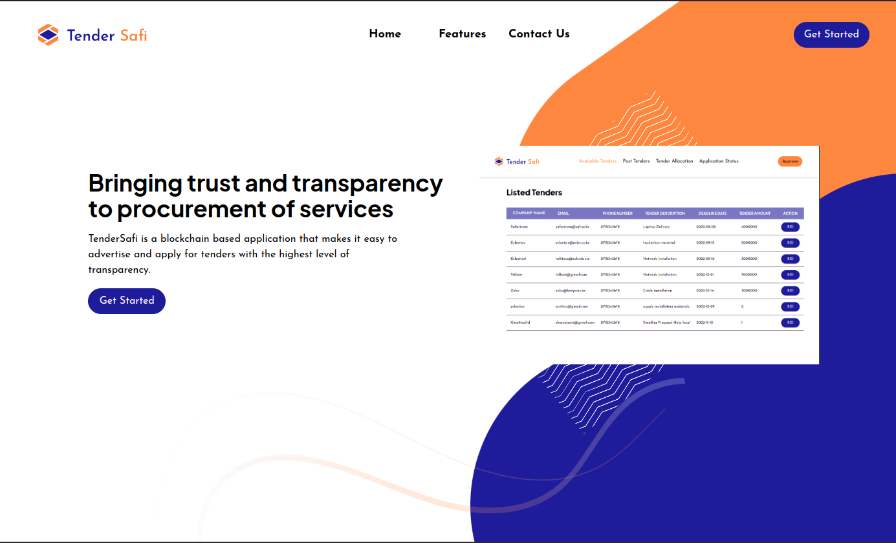

# TenderSpace Web App
## By Dennis Kimathi | Antony Kimani | Ronnex Ondimu | Mercy Wanjiru

## Screenshot
 

 ## Table of Content
 - [Description](#description)
 - [Features](#features)
 - [Design Driven Development](#Design-Driven-Development)
 - [Requirements](#requirements)
 - [Installation Process](#installation-Process)
 - [Live Link](#Live-Link)
 - [Technology  Used](#technology-Used)
 - [License](#license)
 - [Authors Info](#Authors-Info)


## Description
<p>Tender Space</p>

[Go Back to the top](#TenderSpace-Web-app)
## Features
1. As a user(business), I want to create tender to procure services using a unique address.
2. As a user(bidder), I want to sign in using my address and bid for open available tenders.
3. As a user(business), I want to approve business that meet the preferred criteria.
4. As a user(bidder), I want to view tender application status.
4. As a user(bidder), I want view which company the tender is allocated to..


[Go Back to the top](#TenderSpace-Web-app)

## Design Driven Development

Use the link to find the project design.

Figma Design -[TenderSpace-Web-app](https://www.figma.com/file/fxzefSk00z49RSq63vrxTw/TenderSafi?node-id=3%3A1479&t=tdUpMOUe5iU3unmI-1)

[Go Back to the top](#TenderSpace-Web-app)

 ###  Requirements
 * Access to  a computer 
 * Access to internet

 ### Installation Process
 ****
* Clone to the repo : git clone https://github.com/DennohKim/TenderSpace-Polygon
* Run the following command to start the vite app ``` npm run dev```

 ****
 [Go Back to the top](#TenderSpace-Web-app)

### Live Link
- Click this link to view the live application 

### Technology  Used
* REACT - which was used to develope the structure off the pages.
* TAILWINDCSS - which was used to style the User Interface.
* SOLIDITY - which was used to create the smart contract.
* HARDHAT - which was used as development environment for the smart contract.
* VERCEL - which was used to deploy the project on vercel for frontend.
* CELO ALFAJORES- which was used to deploy the contract on the blockchain.
[Go Back to the top](#TenderSpace-Web-app)

## Known Bugs


## License
MIT License
Copyright (c) [2022] [License](LICENSE.txt)
Permission is hereby granted, free of charge, to any person obtaining a copy
of this software and associated documentation files (the "Software"), to deal
in the Software without restriction, including without limitation the rights
to use, copy, modify, merge, publish, distribute, sublicense, and/or sell
copies of the Software, and to permit persons to whom the Software is
furnished to do so, subject to the following conditions:
The above copyright notice and this permission notice shall be included in all
copies or substantial portions of the Software.
THE SOFTWARE IS PROVIDED "AS IS", WITHOUT WARRANTY OF ANY KIND, EXPRESS OR
IMPLIED, INCLUDING BUT NOT LIMITED TO THE WARRANTIES OF MERCHANTABILITY,
FITNESS FOR A PARTICULAR PURPOSE AND NONINFRINGEMENT. IN NO EVENT SHALL THE
AUTHORS OR COPYRIGHT HOLDERS BE LIABLE FOR ANY CLAIM, DAMAGES OR OTHER
LIABILITY, WHETHER IN AN ACTION OF CONTRACT, TORT OR OTHERWISE, ARISING FROM,
OUT OF OR IN CONNECTION WITH THE SOFTWARE OR THE USE OR OTHER DEALINGS IN THE
SOFTWARE.
[Go Back to the top](#TenderSpace-Web-app)

## Authors Info
Contributors - [Dennis Kimathi](https://github.com/DennohKim)
[Antony Kimani](https://github.com/anthonykimani)
[Ronnex Ondimu](https://github.com/Ronexlemon)
[Mercy Wanjiru]()


[Go Back to the top](#TenderSpace-Web-app)